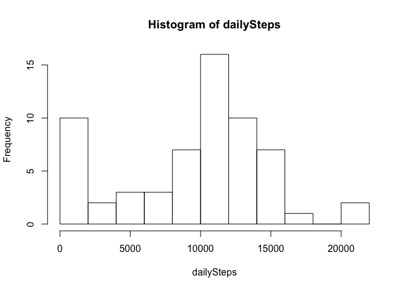
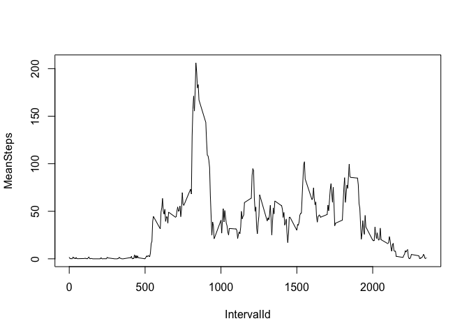
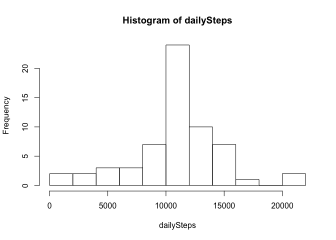

# Reproducible Research: Peer Assessment 1


## Loading and preprocessing the data
Firstly, unzip compressed file to generate csv file, load data into R and save as object activity_data. Look at loaded data using str(), to check format, variables and number of observations

```r
unzip("activity.zip")
activity_data <- read.csv("activity.csv")
str(activity_data)
```

```
## 'data.frame':	17568 obs. of  3 variables:
##  $ steps   : int  NA NA NA NA NA NA NA NA NA NA ...
##  $ date    : Factor w/ 61 levels "2012-10-01","2012-10-02",..: 1 1 1 1 1 1 1 1 1 1 ...
##  $ interval: int  0 5 10 15 20 25 30 35 40 45 ...
```

## What is mean total number of steps taken per day?
The dataframe consists of 3 variables and 17568 observations, including NA values for the steps variable; the date variable has 61 levels (61 days).

Write each variable of activity_data as a separate vector, and creates a vector of unique date values.

```r
steps <- activity_data$steps
dates <- activity_data$date
ids <- activity_data$interval

unique_dates <- unique(dates)
```


Then create blank numeric vectors that will contain daily values of steps, the number of non-NA observations and the number of NAs.


```r
dailySteps <- vector(mode = "numeric", length = length(unique_dates))
numberDailyObs <- vector(mode = "numeric", length = length(unique_dates))
numberDailyNAs <- vector(mode = "numeric", length = length(unique_dates))
```

Then for each day, sum the number of steps, NA and non-NA values.

```r
for (i in seq_along(unique_dates)) {
        logicDay <- dates == unique_dates[i]
        daySubset <- steps[logicDay]
        dailySteps[i] <- sum(daySubset, na.rm = TRUE)
        numberDailyNAs[i] <- sum(is.na(daySubset))
        numberDailyObs[i] <- sum(!is.na(daySubset))
}
```
Then plot a histogram of daily steps, and calculate and report mean and median number of daily steps


```r
hist(dailySteps, breaks = 8)
```

 

```r
meanSteps <- mean(dailySteps)
medianSteps <- median(dailySteps)
paste("mean daily steps =", meanSteps, sep = " ")
```

```
## [1] "mean daily steps = 9354.22950819672"
```

```r
paste("median daily steps =", medianSteps, sep = " ")
```

```
## [1] "median daily steps = 10395"
```

## What is the average daily activity pattern?

First, create vector of unique interval ids, and blank vectors to take the mean number of steps for each interval averaged over the days, and the number of non-NA and NA observations for each interval.


```r
unique_id <- unique(ids)
idSteps <- vector(mode = "numeric", length = length(unique_id))
idObs <- vector(mode = "numeric", length = length(unique_id))
idNAs <- vector(mode = "numeric", length = length(unique_id))
```

Then for each interval, take the mean number of steps over all days, and similarly for NA and non-NA values.

```r
for (i in seq_along(unique_id)) {
        logicId <- ids == unique_id[i]
        idSubset <- steps[logicId]
        idSteps[i] <- mean(idSubset, na.rm = TRUE)
        idNAs[i] <- sum(is.na(idSubset))
        idObs[i] <- sum(!is.na(idSubset))
}
```
Now create a dataframe with unique interval id and mean step values and make the time series plot of mean steps versus interval id.


```r
intervalMean <- cbind(unique_id, idSteps)
colnames(intervalMean) <- c("IntervalId", "MeanSteps")
plot(intervalMean, type = "l")
```

 

Then find and report the interval id which has maximum mean steps.

```r
peakId <- unique_id[idSteps == max(idSteps)]
paste("Interval with maximum number of steps averaged over all days is", peakId, sep = " ")
```

```
## [1] "Interval with maximum number of steps averaged over all days is 835"
```

## Imputing missing values
The total number of rows with missing values is found and reported:

```r
countNAs <- 0
for(i in 1:17568) {
        if (sum(is.na(activity_data[i,])) > 0) countNAs <- countNAs + 1
}
paste("The number of NAs in dataframe is", countNAs, sep = " ")
```

```
## [1] "The number of NAs in dataframe is 2304"
```
Missing values occur only in the steps variable, as seen below:


```r
sum(is.na(steps))
```

```
## [1] 2304
```

```r
sum(is.na(ids))
```

```
## [1] 0
```

```r
sum(is.na(dates))
```

```
## [1] 0
```

Create new data set that replaces missing values (NAs) with the mean for that interval.

```r
new_data <- activity_data

for(i in 1:17568) {
        if (is.na(steps[i])) {
                logic_id <- intervalMean[,1] == ids[i]
                id_mean <- intervalMean[,2][logic_id]
                new_data$steps[i] <- id_mean
        } else new_data$steps[i] <- activity_data$steps[i]
}
```
For the new data set:

```r
steps <- new_data$steps
dates <- new_data$date
ids <- new_data$interval
```

As before create blank vectors that will contain daily values of steps, the number of non-NA observations and the number of NAs.


```r
dailySteps <- vector(mode = "numeric", length = length(unique_dates))
numberDailyObs <- vector(mode = "numeric", length = length(unique_dates))
numberDailyNAs <- vector(mode = "numeric", length = length(unique_dates))
```

Then for each day, sum the number of steps, NA and non-NA values.

```r
for (i in seq_along(unique_dates)) {
        logicDay <- dates == unique_dates[i]
        daySubset <- steps[logicDay]
        dailySteps[i] <- sum(daySubset, na.rm = TRUE)
        numberDailyNAs[i] <- sum(is.na(daySubset))
        numberDailyObs[i] <- sum(!is.na(daySubset))
}
```
Then plot a histogram of daily steps as before, and calculate and report mean and median number of daily steps


```r
hist(dailySteps, breaks = 8)
```

 

```r
meanSteps <- mean(dailySteps)
medianSteps <- median(dailySteps)
paste("mean daily steps =", meanSteps, sep = " ")
```

```
## [1] "mean daily steps = 10766.1886792453"
```

```r
paste("median daily steps =", medianSteps, sep = " ")
```

```
## [1] "median daily steps = 10766.1886792453"
```

## Are there differences in activity patterns between weekdays and weekends?
